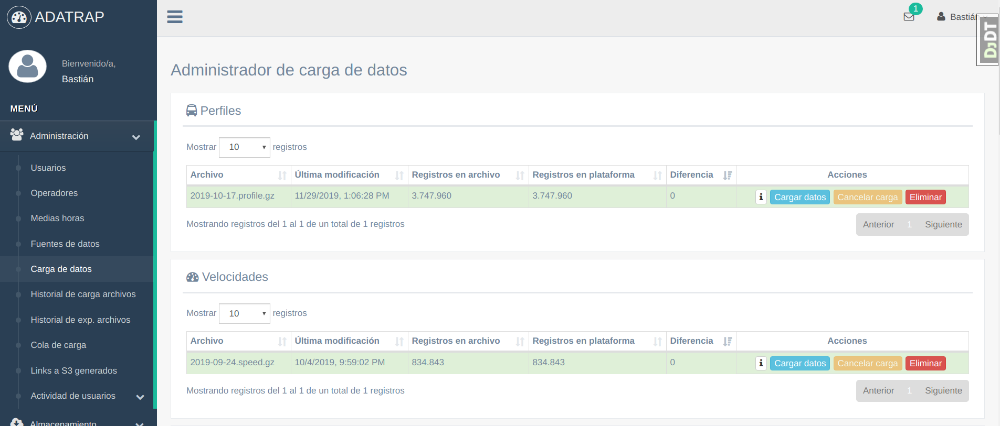

### ADATRAP

Plataforma de visualización para grandes volúmenes de datos sobre el Transantiago.

### Instalación del proyecto

Este proyecto se encuentra desarrollado en Python 2.7, utilizando el framework Django, base de datos Postgresql y  las tecnologías Elasticsearch y Redis.
 
En primer lugar se debe descargar el proyecto:

`git clone https://github.com/SmartcitySantiagoChile/fondefVizServer `

#### Requerimientos

#####Dependencias Python
Se deben instalar las dependencias de python especificadas en el archivo `requirements.txt` 
ubicado en la raíz del proyecto. 

Se recomienda la utilización de un entorno virtual, se puede crear utilizando el comando:

    virtualenv venv

Luego se debe activar el entorno virtual e instalar las dependencias.

    # activar
    source venv/bin/activate
 
    # instalar dependencias
    pip install -r requirements.txt

#####Postgresql
Para la base de datos relacional se utilizará Postgresql, el cuál se puede descargar en el siguiente enlace:

>https://www.postgresql.org/download/

#####Elasticsearch 6.2.3

Para realizar el servicio de búsquedas se utilizará el servicio Elasticsearch 6.2.3, el cual requiere para su funcionamiento JDK.

Para la instalación de JDK se sugiere Open JDK 8, el cual se puede descargar en el siguiente enlace:

>https://openjdk.java.net/install/

Habiendo instalado JDK se procede instalar elasticsearch, el cuál se puede descargar en el siguiente enlace:
>https://www.elastic.co/es/downloads/past-releases/elasticsearch-6-2-3

#####Redis

Como servicio de base de datos en memoria principal, para el uso de procesos en segundo plano
 y almacenamiento temporal de archivos se utilizará Redis, el cuál se puede descargar en el siguiente enlace:
>https://redis.io/download

Opcionalmente conviene instalar redis-tools para tener un mayor control y monitoreo de los servicios de Redis. Esta
 herramienta se puede instalar ejecutando el siguiente comando: 

    sudo apt install redis-tools

#####Npm

Para poder utilizar bower se requiere tener instalado el gestor de paquetes npm:

>https://www.npmjs.com/get-npm

#####Bower

Como gestor de dependencias para el frontend del proyecto se utilizará Bower:

    sudo snap install bower 

### Configuración del Proyecto

####Postgres

Se requiere crear la base de datos relacional del proyecto, por lo que crearemos una nueva en PostgresQL. Accedemos a postgres:

    sudo -u postgres psql
    
En postgres, creamos la base de datos:

    CREATE DATABASE databasename;

#### .env
    
Se debe crear un archivo .env en la raíz del proyecto con fin de mantener encapsuladas las variables utilizadas por `settings.py` de Django.
El archivo .env contiene las siguientes definiciones:

    #Configuraciones generales de Django
    
    SECRET_KEY=                   
    DEBUG=TRUE
    ALLOWED_HOSTS=localhost, 127.0.0.1                                   
    INTERNAL_IPS=localhost, 127.0.0.1
    URL_PREFIX=''
    DOWNLOAD_PATH=
    
    #Configuraciones de Postgres
    
    DB_NAME=
    DB_USER=
    DB_PASS=
    DB_HOST=localhost
    DB_PORT=5431
    
    
    #Configuraciones de Elasticsearch
    
    ELASTICSEARCH_HOST=localhost
    ELASTICSEARCH_PORT=9200
   
    
    #Configuraciones de Redis
    REDIS_HOST=localhost
    REDIS_PORT=6379
    REDIS_DB=0
    
    
    #Configuraciones de email
    
    EMAIL_HOST=
    EMAIL_PORT=0
    EMAIL_USE_TLS=
    EMAIL_HOST_USER=
    EMAIL_HOST_PASSWORD=
    SERVER_EMAIL=
    
    
    #Configuraciones de buckets para almacenamiento de datos en S3
    
    GPS_BUCKET_NAME=
    OP_PROGRAM_BUCKET_NAME=
    FILE_196_BUCKET_NAME=
    PROFILE_BUCKET_NAME=
    STAGE_BUCKET_NAME=
    SPEED_BUCKET_NAME=
    TRANSACTION_BUCKET_NAME=
    TRIP_BUCKET_NAME=
    REPRESENTATIVE_WEEk_BUCKET_NAME=
    
    
    #Configuraciones de Amazon Web Service
    
    AWS_ACCESS_KEY_ID=
    AWS_SECRET_ACCESS_KEY=
   

Estos datos se dividen en las siguientes secciones:

#####Configuraciones generales de Django
* SECRET_KEY: string que representa una semilla en python para seguridad.                     
* DEBUG: ejecutar la aplicación en modo debug (TRUE/FALSE).
* ALLOWED_HOSTS: conexiones permitidas para el ingreso a la aplicación.                                   
* INTERNAL_IPS: conexiones que mostraran la debug toolbar y debug panel
* URL_PREFIX:
* DOWNLOAD_PATH: path de descarga para archivos manipulados por redis

#####Configuraciones de Postgres

* DB_NAME: nombre de la base de datos
* DB_USER: usuario de la base de datos
* DB_PASS: password de la base de datos
* DB_HOST: host de la base de datos
* DB_PORT: puerto de la base de datos

#####Configuraciones de Elasticsearch

* ELASTICSEARCH_HOST: host de elasticsearch
* ELASTICSEARCH_PORT: puerto de elasticsearch

#####Configuraciones de Redis

* REDIS_HOST: host de redis
* REDIS_PORT: puerto de redis
* REDIS_DB: nombre de la base de datos de redis

#####Configuraciones de email
* EMAIL_HOST:
* EMAIL_PORT:
* EMAIL_USE_TLS:
* EMAIL_HOST_USER:
* EMAIL_HOST_PASSWORD:
* SERVER_EMAIL:

#####Configuraciones de buckets para almacenamiento de datos en S3
* GPS_BUCKET_NAME:
* OP_PROGRAM_BUCKET_NAME:
* FILE_196_BUCKET_NAME:
* PROFILE_BUCKET_NAME:
* STAGE_BUCKET_NAME:
* SPEED_BUCKET_NAME:
* TRANSACTION_BUCKET_NAME:
* TRIP_BUCKET_NAME:
* REPRESENTATIVE_WEEk_BUCKET_NAME: 

#####Configuraciones de Amazon Web Service
* AWS_ACCESS_KEY_ID:
* AWS_SECRET_ACCESS_KEY:

#### Logs

En el directorio `/fondefVizServer/logs` hay que crear un archivo `file.log` con fin de mantener registros de la 
aplicación. 

#### Modelos y Usuarios de Django

Para propagar los modelos en la base de datos se deben hacer las migraciones de Django ejecutando el siguiente
comando:

    $ python manage.py migrate

Se deben cargar los datos base para formularios a utilizar en la aplicación, para esto ejecutaremos el siguiente comando:

    $ python manage.py loaddata datasource communes daytypes halfhours operators timeperiods transportmodes

Se debe crear un super usuario para poder acceder a la aplicación desde la interfaz web, esto se hace por medio del siguiente comando:
    
    $ python manage.py createsuperuser

Se debe ejecutar django_js_reverse para el manejo de las urls en los archivos js:

    $ python manage.py collectstatic_js_reverse

Se debe actualizar el submódulo de los rqworkers que ejecutarán los procesos segundo plano:

    git submodule init

    git submodule update

Finalmente hay que instalar las dependencias js y css con bower.

    bower install

    
### Ejecución de la aplicación 

#### Servicios complementarios 

Para el correcto funcionamiento de la aplicación se deben ejecutar los siguientes
servicios:

Se debe ejecutar el servicio de búsquedas Elasticsearch:

    $ ./elasticsearch-6.2.3/bin/elasticsearch

Se deben crear los índices para Elasticsearch para ello ejecutamos el siguiente comando:

    $ python manage.py createindexes

Se debe ejecutar Redis para el servicio de procesos en segundo plano.
 
    $ ./redis-5.0.7/src/redis-server

Para ejecutar los procesos en segundo plano de la aplicación, se deben dejar corriendo los rqworkers con
el siguiente comando:

    $ python manage.py rqworker count_lines data_exporter data_uploader
   
Finalmente se debe ejecutar la aplicación Django:

    $ python manage.py runserver
   

### Carga de Datos

Para realizar la carga de datos se requiere la ejecución de al menos un rqworker para cada tipo:

    $ python manage.py rqworker count_lines data_exporter data_uploader

Ingresando a la aplicación, se debe ir a la sección de Administración, Fuentes de datos. 
En esta sección deben modificar los directorios de los archivos a cargar:

Posteriormente se debe ejecutar el comando `searchfiles.py`, el cual se encargará de buscar 
los archivos en los directorios modificados anteriormente e ingresarlos a la tabla para su posterior carga.
Por lo que ejecutamos:

    $ python manage.py searchfiles
 
Esto permitirá la visualización de los datos en la sección Administración, Carga de datos.
En esta sección debe seleccionar la opción "cargar datos" para cada uno de los archivos.

Si la carga de datos se realizó de forma satisfactoria, serán visibles las distintas consultas
de la aplicación:

### Opcionales

#### Monitorear RQworkers
Se puede monitorear los workers utilizando el cliente de redis por medio de los siguientes comandos:

    $ ./redis-5.0.7/src/redis-cli
    $ monitor
    
#### Monitorear Elasticsearch
Para monitoriar el funcionamiento de Elasticsearch se puede utilizar Cerebro, el cuál se puede descargar en el siguiente enlace:

>https://github.com/lmenezes/cerebro

Posteriormente se debe ejecutar cerebro:

`./cerebro-0.8.5/bin/cerebro`

En la aplicación cerebro se debe ingresar url y puerto por la que se ejecuta elasticsearch.

