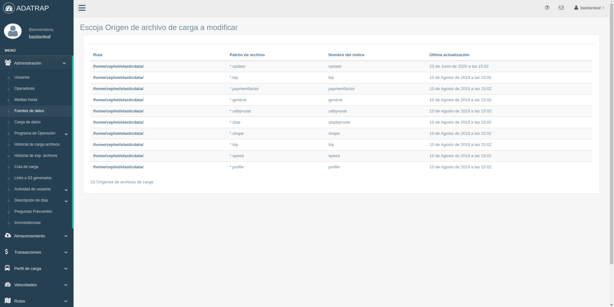

[](https://travis-ci.com/SmartcitySantiagoChile/fondefVizServer)

[](https://coveralls.io/github/SmartcitySantiagoChile/fondefVizServer?branch=master)

### ADATRAP

Plataforma de visualización para grandes volúmenes de datos de Transantiago.

ADATRAP nació el año 2007 a través de un trabajo colaborativo entre la Universidad de Chile (departamento de transporte de la facultad de ingeniería) y el Directorio de Transporte Público Metropolitano (DTPM) con el objetivo de generar métricas que permitan entender y mejorar el sistema de transporte público a través del uso de los pulsos GPS de buses y transacciones Bip!

ADATRAP está compuesto de dos proyectos: procesamiento de datos y visualización de datos. Este repositorio está dedicado al segundo.

Hoy en día ADATRAP genera varios tipos de datos y los usados en esta plataforma de visualización corresponden a:

1. Perfiles de carga por servicio
2. Velocidades por servicio
3. Viajes
4. Factores de pago para zonas pagas
5. Matrices origen-destino por servicio
6. Estadísticas globales relacionados al cálculo de los datos

A continuación se describe el proceso de instalación para un entorno de desarrollo. Es importan indicar que los pasos pueden cambiar dependiendo del sistema operativo e [IDE](https://es.wikipedia.org/wiki/Entorno_de_desarrollo_integrado) que se use.

### Instalación del proyecto

Este proyecto se encuentra desarrollado en Python 3.7, utilizando el framework web Django, base de datos relacional Postgresql, el motor de análisis de datos Elasticsearch y Redis como base de datos en memoria.

En primer lugar se debe descargar el proyecto desde Github: 

`git clone https://github.com/SmartcitySantiagoChile/fondefVizServer `

#### Requerimientos

##### Creación de entorno virtual

Para no tener conflictos de dependencias se recomienda hacer uso de un [entorno virtual](https://docs.python.org/3/tutorial/venv.html), este puede ser creado usando la librería [virtualenv](https://virtualenv.pypa.io/en/latest/).
```
    # instalar librería virtualenv
    pip install virtualenv

    # crear entorno virtual
    virtualenv venv

    # activar entorno virtual
    source venv/bin/activate
```

##### Instalación de dependencias Python

Las librerías necesarias para ejecutar el proyecto están definidas en el archivo `requirements.txt` 
ubicado en la raíz del proyecto y se pueden instalar rápidamente con el comando `pip install -r requirements.txt`.

##### Postgresql

La base de datos relacional es utilizada para el almacenamiento de datos asociados a la plataforma web, como lo son los usuarios que pueden acceder, estadísticas de uso del sitio web, parámetros de configuración, entre otros.

La descarga e instalación se puede realizar siguiendo los pasos del siguiente enlace:

>https://www.postgresql.org/download/

##### Elasticsearch (versión: 6.2.3)

Los datos generados por ADATRAP son almacenados en una (o más) instancia(s) de elasticsearch. Es importante tener en cuenta que es necesario contar con una versión de Java para su ejecución. Se recomienda instalar una versión de [openJDK 8](https://openjdk.java.net/install/) para su ejecución (solo disponible para ambientes Linux), para entornos con sistema operativo (S.O) Windows se recomienda descargar desde la [página oficial](https://www.oracle.com/technetwork/java/javase/downloads/index.html) de Oracle.

Habiendo instalado JDK se procede instalar Elasticsearch, se puede descargar desde el siguiente enlace:
>https://www.elastic.co/es/downloads/past-releases/elasticsearch-6-2-3

##### Redis

La base de datos en memoria principal (RAM) es utilizada en algunos procesos que requieren la ejecución de tareas asíncronas, como lo puede ser el proceso para exportar datos, envío de correos eléctronicos o la carga de datos.

Redis puede ser descargado desde el siguiente enlace:
>https://redis.io/download

Opcionalmente (pero muy recomendable) conviene instalar `redis-tools` para tener un mayor control y monitoreo de Redis ya que permite inspeccionar los datos almacenados o su [comportamiento en tiempo real](https://redis.io/commands/MONITOR). Esta herramienta se puede instalar en Ubuntu ejecutando el siguiente comando: 

    sudo apt install redis-tools

##### Npm y Bower

La administración de las librerías `Javascript` (usadas por la página web) son administradas por Bower, herramienta que requiere tener instalado el gestor de paquetes npm:

>https://www.npmjs.com/get-npm

Luego de la instalación de npm se procede a instalar Bower.

```
    npm install -g bower 
```

### Configuración del Proyecto

#### Postgres

Se requiere crear la base de datos relacional del proyecto, por lo que crearemos una nueva en PostgreSQL:

```
    # acceso a psql con usuario postgres (Ubuntu)
    sudo -u postgres psql
    
    # una vez dentro, se crea la base de datos:
    CREATE DATABASE aqui_el_nombre_de_tu_base_de_datos;
```

#### .env
    
Se debe crear un archivo .env en la raíz del proyecto con fin de mantener encapsuladas las variables utilizadas por `settings.py` de Django, esto se realiza porque estos valores cambian dependiendo del entorno en que se esté ejecutando la plataforma (desarrollo o producción).

El archivo .env contiene las siguientes definiciones:

    # Configuraciones generales de Django
    SECRET_KEY=                   
    DEBUG=TRUE
    ALLOWED_HOSTS=localhost, 127.0.0.1                                   
    INTERNAL_IPS=localhost, 127.0.0.1
    URL_PREFIX=''
    DOWNLOAD_PATH=
    
    # Configuraciones de Postgres
    DB_NAME=
    DB_USER=
    DB_PASS=
    DB_HOST=localhost
    DB_PORT=5431
    
    # Configuraciones de Elasticsearch
    ELASTICSEARCH_HOST=localhost
    ELASTICSEARCH_PORT=9200
    
    # Configuraciones de Redis
    REDIS_HOST=localhost
    REDIS_PORT=6379
    REDIS_DB=0
    
    # Configuraciones de email
    EMAIL_HOST=
    EMAIL_PORT=0
    EMAIL_USE_TLS=
    EMAIL_HOST_USER=
    EMAIL_HOST_PASSWORD=
    SERVER_EMAIL=
    
    # Configuraciones de buckets para almacenamiento de datos en S3
    GPS_BUCKET_NAME=
    OP_PROGRAM_BUCKET_NAME=
    FILE_196_BUCKET_NAME=
    PROFILE_BUCKET_NAME=
    STAGE_BUCKET_NAME=
    SPEED_BUCKET_NAME=
    TRANSACTION_BUCKET_NAME=
    TRIP_BUCKET_NAME=
    REPRESENTATIVE_WEEk_BUCKET_NAME=
    
    # Configuraciones de Amazon Web Service
    AWS_ACCESS_KEY_ID=
    AWS_SECRET_ACCESS_KEY=
   

Estos datos se dividen en las siguientes secciones:


##### Configuraciones generales de Django
* SECRET_KEY: string que representa una semilla en python para seguridad.                     
* DEBUG: ejecutar la aplicación en modo debug (TRUE/FALSE).
* ALLOWED_HOSTS: conexiones permitidas para el ingreso a la aplicación.                                   
* INTERNAL_IPS: conexiones que mostraran la debug toolbar y debug panel
* URL_PREFIX:
* DOWNLOAD_PATH: path de descarga para archivos manipulados por redis

##### Configuraciones de Postgres

* DB_NAME: nombre de la base de datos
* DB_USER: usuario de la base de datos
* DB_PASS: password de la base de datos
* DB_HOST: host de la base de datos
* DB_PORT: puerto de la base de datos

##### Configuraciones de Elasticsearch

* ELASTICSEARCH_HOST: host de elasticsearch
* ELASTICSEARCH_PORT: puerto de elasticsearch


##### Configuraciones de Redis

* REDIS_HOST: host de redis
* REDIS_PORT: puerto de redis
* REDIS_DB: nombre de la base de datos de redis


##### Configuraciones de email
* EMAIL_HOST:
* EMAIL_PORT:
* EMAIL_USE_TLS:
* EMAIL_HOST_USER:
* EMAIL_HOST_PASSWORD:
* SERVER_EMAIL:


##### Configuraciones de buckets para almacenamiento de datos en S3
* GPS_BUCKET_NAME:
* OP_PROGRAM_BUCKET_NAME:
* FILE_196_BUCKET_NAME:
* PROFILE_BUCKET_NAME:
* STAGE_BUCKET_NAME:
* SPEED_BUCKET_NAME:
* TRANSACTION_BUCKET_NAME:
* TRIP_BUCKET_NAME:
* REPRESENTATIVE_WEEk_BUCKET_NAME: 


##### Configuraciones de Amazon Web Service
* AWS_ACCESS_KEY_ID:
* AWS_SECRET_ACCESS_KEY:

#### Logs

En el directorio `/fondefVizServer/logs` hay que crear un archivo `file.log` con fin de mantener registros de la 
aplicación. 


#### Modelos y Usuarios de Django

Para crear las tablas en la base de datos se deben ejecutar las migraciones de Django ejecutando el siguiente
comando:

    $ python manage.py migrate

Luego se deben cargar los datos base requeridos por la aplicación web, para esto se debe ejecutar la siguiente instrucción:

    $ python manage.py loaddata datasource communes daytypes halfhours operators timeperiods transportmodes

La interfaz web requiere de un usuario para acceder por loq que se debe crear un super usuario, esto se hace por medio del comando:
    
    $ python manage.py createsuperuser


Se debe ejecutar django_js_reverse para el manejo de las urls en los archivos js:

    $ python manage.py collectstatic_js_reverse

Se debe actualizar el submódulo de los rqworkers que ejecutarán los procesos segundo plano:

    git submodule init

    git submodule update

Finalmente hay que instalar las dependencias js y css con bower.

    bower install

    
### Ejecución de la aplicación 

#### Servicios complementarios 

Para el correcto funcionamiento de la aplicación se deben ejecutar los siguientes
servicios:

Se debe ejecutar el servicio de búsquedas Elasticsearch:

    $ ./elasticsearch-6.2.3/bin/elasticsearch


Se deben crear los índices para Elasticsearch para ello ejecutamos el siguiente comando:

    $ python manage.py createindexes


Se debe ejecutar Redis para el servicio de procesos en segundo plano.
 
    $ ./redis-5.0.7/src/redis-server

Para ejecutar los procesos en segundo plano de la aplicación, se deben dejar corriendo los rqworkers con
el siguiente comando:

    $ python manage.py rqworker count_lines data_exporter data_uploader
   
Finalmente se debe ejecutar la aplicación Django:

    $ python manage.py runserver
   


### Carga de Datos

Para realizar la carga de datos se requiere la ejecución de al menos un rqworker para cada tipo:

    $ python manage.py rqworker count_lines data_exporter data_uploader

Ingresando a la aplicación, se debe ir a la sección de Administración, Fuentes de datos. 
En esta sección deben modificar los directorios de los archivos a cargar:



Posteriormente se debe ejecutar el comando `searchfiles.py`, el cual se encargará de buscar 
los archivos en los directorios modificados anteriormente e ingresarlos a la tabla para su posterior carga.
Por lo que ejecutamos:

    $ python manage.py searchfiles
 
Esto permitirá la visualización de los datos en la sección Administración, Carga de datos.
En esta sección debe seleccionar la opción "cargar datos" para cada uno de los archivos.


Si la carga de datos se realizó de forma satisfactoria, serán visibles las distintas consultas
de la aplicación:


### Docker
Docker es una tecnología que permite trabajar en ambientes controlados, aislados del resto de librerías del sistema operativo y operan bajo una lógica sin estado (stateless).

Para crear la imagen docker y ejecutarla se utilizan los siguientes comandos:

Construir imagen:

`docker-compose -f docker/docker-compose.yml build`

Antes de ejecutar la imagen es necesario aumentar la memoria virtual para el servicio de elasticsearch:

`sysctl -w vm.max_map_count=262144`


Ejecutar:

`docker-compose -f docker/docker-compose.yml up`

Detener:

`docker-compose -f docker/docker-compose.yml down`

Para ejecutar los tests es necesario construir la imagen y luego ejecutarla usando el flag --abort-on-container-exit,
esto con fin de evitar que siga ejecutándose el ambiente de pruebas posterior a la finalización de los tests.

Construir la imagen:

`docker-compose -f docker/docker-compose-test.yml build ` 

Ejecutar tests:
 
`docker-compose -f docker/docker-compose-test.yml up --abort-on-container-exit` 

### Actualizar dataUploader
Cada vez que exista una nueva release de dataUploader se debe actualizar la versión del submódulo del proyecto. Desde la raíz del proyecto se debe direccionar al módulo dataUploader:

    cd dataUploader

Actualizar vía git:

    git pull origin master

Volver al proyecto

    cd ..

Hacer commit de la actualización

    git add dataUploader
    git commit -m "Update dataUploader"

Finalmente actualiar vía pip

    pip install -r requirements.txt

### Opcionales

#### Monitorear RQworkers
Se puede monitorear los workers utilizando el cliente de redis por medio de los siguientes comandos:

    $ ./redis-5.0.7/src/redis-cli
    $ monitor
    
#### Monitorear Elasticsearch
Para monitoriar el funcionamiento de Elasticsearch se puede utilizar Cerebro, el cuál se puede descargar en el siguiente enlace:

>https://github.com/lmenezes/cerebro

Posteriormente se debe ejecutar cerebro:

`./cerebro-0.8.5/bin/cerebro`

En la aplicación cerebro se debe ingresar url y puerto por la que se ejecuta elasticsearch.
